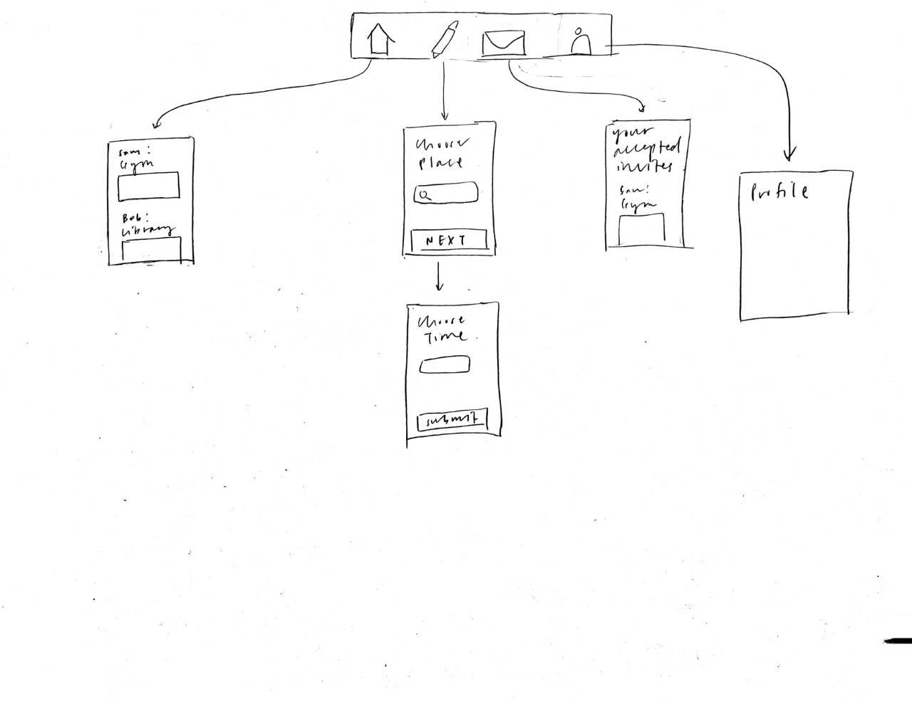

# findABuddy

Original App Design Project - README Template
===

## buddy finding app

## Table of Contents
1. [Overview]
1. [Product Spec](#Product-Spec)
1. [Wireframes](#Wireframes)
2. [Schema](#Schema)

## Overview
### Description
Users can broadcast a place they want to go to (ex: gym, restaurant, library) so that others can join them.

### App Evaluation
[Evaluation of your app across the following attributes]
- **Category:** Social
- **Mobile:** Easy access
- **Story:** Allows users to broadcast a place they want to go to so that others can join them
- **Market:** Everyone!
- **Habit:** Users can use app anytime they want to find a buddy to do something/go somewhere with
- **Scope:** 

## Product Spec

### 1. User Stories (Required and Optional)

**Required Must-have Stories**

* User can login, signup, and logout of account
* Users can view their home feed screen and invitation creation screen

**Optional Nice-to-have Stories**

* Users can view their profile
* Users can see photos of the place
* Users can see how far away the place is
* Users can leave a review for the place using Yelp API
* Users can see the invitations they accepted

### 2. Screen Archetypes

* Login/signup screen
   * user can login/signup
* Home feed Screen
* Create invitation Screen

### 3. Navigation

**Tab Navigation** (Tab to Screen)

* Home feed Screen
* Create invitation Screen

**Flow Navigation** (Screen to Screen)

* inivitaiton fragment --> detail inivtation fragment

## Wireframes
[Add picture of your hand sketched wireframes in this section]

### [BONUS] Digital Wireframes & Mockups

### [BONUS] Interactive Prototype

## Schema
### Models

New Place:

| Property | Type | Description |
| -------- | ------ | --------------------------- |
| objectId | String | unique id for the user post |
| name | String | name for the user place |
| location | JSON Object | location of the place |

Invitation:

| Property | Type | Description |
| -------- | ------ | --------------------------- |
| objectId | String | unique id for the user invitation |
| author | Pointer to User | invatation author |
| caption | String | invitation caption by author |
| acceptedCount | Number | number of people who accepted invitation |
| acceptedUsers | Array | array of users that accepted invitation |
| time | DateTime | date when the event will take place |

User:

| Property | Type | Description |
| -------- | ------ | --------------------------- |
| objectId | String | unique id for the user |
| username | String | user's username |
| password | String | user's password |
| profilePic | File | image that is the user's profile pic |
| acceptedInvitations | Array | array of invitations that the user accepted |

### Networking
List of network requests by screen
* Home Feed Screen
   * (Read/GET) Query all invitations where user is author
   * (Create/POST) Create a new invitation accept
   * (Delete) Delete an existing invitation accept
* Create Invitation Screen
   * (Create/POST) Create a new invitation
* Profile Screen
   * (Read/GET) Query logged in user object
   * (Update/PUT) Update user profile image
  
- [Create basic snippets for each Parse network request]
- [OPTIONAL: List endpoints if using existing API such as Yelp]

Google Places SDK

| HTTP Verb | Endpoint | Description
| --------- | -------- | ------------|
| GET | /place/details/json | gets the details of the specified place |
